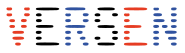

<!--  -->

<!-- **Did you attend Alice & Eve 2024? Please fill out our feedback form: [https://forms.gle/cFKzTXHZQpLtyMY17](https://forms.gle/cFKzTXHZQpLtyMY17)**-->

Welcome to our free one-day workshop for celebrating women studying and working in computing!
Alice & Eve aims to bring together talents in the field of computing. The fourth edition of this workshop will be hosted on **25 October 2024** by the Leiden University.

Alice and Eve event is inspired by the [BCS Lovelace Colloquium](https://bcswomenlovelace.bcs.org/) that started in 2008. For more details about earlier editions of Alice & Eve, see the websites of [2020](https://fmt.ewi.utwente.nl/events/aliceandeve2020/), [2021](https://aliceandeve.cs.ru.nl/), [2022](https://alice-and-eve.github.io/2022/) and [2023](https://alice-and-eve.github.io/2023/).

The event is held during a single day, and features:

- keynote talks,
- a poster contest, and
- an exhibition on women in computing.

Join us, and participate to our poster contest on the topic of your choice!

### Date:

Alice & Eve will take place on October 25th, 2024.

### Venue:

The workshop will be held at Leiden.
<!-- <iframe src="https://www.google.com/maps/embed?pb=!1m18!1m12!1m3!1d2436.8666068656294!2d4.95200197667113!3d52.35470457201834!2m3!1f0!2f0!3f0!3m2!1i1024!2i768!4f13.1!3m3!1m2!1s0x47c6093794c982b7%3A0x5ba7c8690917b951!2sLab42!5e0!3m2!1snl!2snl!4v1697828221735!5m2!1snl!2snl" width="600" height="450" style="border:0;" allowfullscreen="" loading="lazy" referrerpolicy="no-referrer-when-downgrade"></iframe> -->
<!-- <iframe src="https://www.google.com/maps/embed?pb=!1m18!1m12!1m3!1d2447.751991104805!2d4.482933476457672!3d52.15701986304036!2m3!1f0!2f0!3f0!3m2!1i1024!2i768!4f13.1!3m3!1m2!1s0x47c5c6f2447daae3%3A0x48e9dc4f075bb167!2z6I6x6aG_5aSn5a2m!5e0!3m2!1szh-CN!2snl!4v1710771504599!5m2!1snl!2snl" width="600" height="450" style="border:0;" allowfullscreen="" loading="lazy" referrerpolicy="no-referrer-when-downgrade"></iframe> -->

### Registration:

The registration is free and includes coffee breaks, lunch and drinks. We welcome everyone of **all genders**, **from bachelor students to full professors**, to attend the event.

Details regarding the registration will follow soon.

<!-- [SIGN UP HERE](https://docs.google.com/forms/d/e/1FAIpQLSeE9nok8a7G8ulDBM83JNBS9gpw6gkSOA836kO2iAQ4QZaLOw/viewform?usp=pp_url&entry.1084557700=Morning+Coffee&entry.1084557700=Lunch&entry.1084557700=Afternoon+Coffee&entry.1084557700=Drinks) -->

## Program

Details regarding the timeline will update soon.

<!--
| Time |  |
|---|---|
| 09.30 - 09.50  | Registration & welcome coffee (L3.36)|
| 09.50 - 10.00  | Opening (L1.02, for all talks)|
| 10.00 - 10.30  | Talk: **Ana Oprescu** - Trilemmas in Software Systems and Education |
| 10.30 - 11.00  | Talk: **Marcela Tuler de Oliveira** - Distributed Access Control: Bridging Trustworthiness and Transparency in Cross-Organizational Data Sharing |
| 11.00 - 11.30  | Coffee Break (L3.36) |
| 11.30 - 12.00  | Talk: **Carla Groenland** - Why combinatorics is useful for (theoretical) computer science  |
| 12.00 - 12.30  | Talk: **Lynda Hardman** - Exploring Relations in Neuroscience Literature using Augmented Reality |
| 12.30 - 14.00  | Lunch + Poster session + Exhibition  (L3.36) |
| 14.00 - 14.30  | Sponsor Lightning Talks (L1.02, for all talks)|
| 14.30 - 15.00  | Talk: **Marieke van Erp** - Mixing AI and humanities for smell history and heritage: the story of Odeuropa  |
| 15.00 - 15.30  | Talk: **Rianne van den Berg** - AI for the natural sciences|
| 15.30 - 16.00  | Coffee Break (L3.36) |
| 16.00 - 16.50  | Panel: **Closing the Gap: Addressing the Digital Divide through Accessible Technology** (speakers: Emma Beauxis-Aussalet, Hinda Haned, Iffat Rose Gill; moderator: Paola Grosso)
| 16.50 - 17.00  | Poster Prizes + closing |
| 17.00 - 18.00  | Drinks and socials (L3.36) |
-->

## Poster Contest

Details regarding the poster contest will update soon.

## Exhibition

Details regarding the exhibition will update soon.

## Speakers

We have invited some inspiring women working on the cutting edge of computing. Confirmed speakers include:

- **[Katja Tuma](https://katjatuma.github.io/)**, Assistant professor at VU Amsterdam
  
  In 2021 I joined the Foundational and Experimental Security research group as Assistant Professor (Universitair docent 2) and am working at the Department of Computer Science at Vrije Universiteit Amsterdam within the Computer Systems group. I hold a Ph.D. in Computer Science and Engineering, which I completed at the University of Gothenburg. I am an active member of EUGAIN (WG3: From Ph.D. to Professor), and diversity co-officer for CSE department at the VU.
  
- **[Anna Sperotto](https://annasperotto.org/)**, Associate professor at U Twente
  
  I am an Associate Professor at the Design and Analysis of Communication Systems (DACS) group at the University of Twente. My research interests lays in the field of Internet Security and Internet measurements. On Octber 14, 2010, I defended my thesis “Flow-based Intrusion Detection”, at the University of Twente.
  
- **[Gabriele Keller](https://www.uu.nl/staff/GKKeller)**, Professor at U Utrecht
  
  My main research interests are functional programming, type systems, high-performance computing, and programming language based approaches to verification. I'm also interested in teaching of functional programming, and have co-authored the (still incomplete) Learning Haskell Tutorial together with Manuel Chakravarty.
  
- **[Anna Wilbik](https://www.maastrichtuniversity.nl/m-wilbik)**, Professor at U Maastricht
  
  I am a researcher who aims at bridging the gap between the meaning of data and human understanding in complex application environments, where data can be of various natures. I am also an academic teacher and mentor, who believes that students learn most, when they are given responsibility and freedom in their learning process. I believe in an international orientation in research and teaching and a balance between academic, curiosity-driven research and industrial, problem-oriented research.
  
- **[Niki van Stein](https://www.nikivanstein.nl/)**, Assistant professor U Leiden
  
  Dr. Niki van Stein is a researcher, heading the XAI group, which is part of the Natural Computing Cluster of LIACS, and manager of the applied data science lab. She received her PhD in Computer Science from Leiden University in 2018. Niki’s research interest are in eXplainable AI for automated machine learning, global (Bayesian) optimization and neural architecture search. She mostly works on research with direct applications in industry, such as predictive maintenance, car and ship design optimization and schedule optimization.
  
- **[Suzan Verberne](https://liacs.leidenuniv.nl/~verbernes/)**, Professor at U Leiden
  
  I am a researcher in Natural Language Processing (NLP) and Information Retrieval (IR). My research focus is text mining and information retrieval in specific domains. I am a Full Professor at the Leiden Institute of Advanced Computer Science (LIACS). I am group leader of Text Mining and Retrieval Leiden.
  My vision is that domain-specific challenges can enable breakthroughs in computer science; more specifically in my fields NLP and IR. I currently supervise projects that develop and evaluate NLP and retrieval methods in a diversity of domains. I am work package leader for two H2020 projects and project co-leader of an NWA project.
  My group works on novel methods for representation learning, ranking, and information extraction. We work with a large diversity of textual data: archaeological reports, patents, scientific and legal publications, health records, newspaper texts, user-generated content in online patient communities (discussion forums), and posts on social media.

## Jobs Board

During the conference, there will be the possibility for attendees to advertise open positions in their university/company. Furthermore, participants looking for jobs are also welcome to post their credentials and type of job/internship they are looking for. Job postings are under the following rules:
- Maximum one A4 flyer per company
- Maximum one A4 sheet per participant looking for jobs
- Each flyer must contain contact information
- Jobs must be pertinent to computing

## Organizing Committee

- [Lu Cao](https://www.universiteitleiden.nl/en/staffmembers/lu-cao%5B2%5D#tab-1), Leiden University
- [Olga Gadyatskaya](https://www.universiteitleiden.nl/en/staffmembers/olga-gadyatskaya#tab-1), Leiden University
- [Eleftheria Makri](https://www.universiteitleiden.nl/en/staffmembers/eleftheria-makri#tab-1), Leiden University
- [Shuang Sun](https://www.universiteitleiden.nl/en/staffmembers/shuang-sun#tab-1), Leiden University

## Advisory Committee

Details regarding the advisory committee will update soon.

## Steering committee

Details regarding the steering committee will update soon.

## Code of Conduct
Alice and Eve is dedicated to providing a harassment-free conference experience for everyone, regardless of gender, gender identity and expression, sexual orientation, disability, physical appearance, body size, race, age or religion. We do not tolerate harassment of conference participants in any form. Conference participants violating these rules may be sanctioned or expelled from the conference at the discretion of the conference organizers.
Harassment includes, but is not limited to:
- Verbal comments that reinforce social structures of domination related to gender, gender identity and expression, sexual orientation, disability, physical appearance, body size, race, age, religion.
- Sexual images in public spaces
- Deliberate intimidation, stalking, or following
- Harassing photography or recording
- Sustained disruption of talks or other events
- Inappropriate physical contact
- Unwelcome sexual attention
- Advocating for, or encouraging, any of the above behaviour
  
Participants asked to stop any harassing behavior are expected to comply immediately. If someone makes you or anyone else feel unsafe or unwelcome, please report it as soon as possible by contacting us ether in person or via email.
<!--
Ilaria Battiston (either in person or via [email](mailto:Ilaria Battiston <ilaria@cwi.nl>)) or Iris Groen (either in person or via [email](mailto:Iris Groen <i.i.a.groen@uva.nl>)).
-->
This Code of Conduct was adapted from the [Geek Feminism Wiki anti-harassment policy](https://geekfeminism.fandom.com/wiki/Conference_anti-harassment/Policy).

## Our Sponsors

We are currently looking for sponsors. Contact [Eleftheria Makri](mailto:Eleftheria Makri <e.makri@liacs.leidenuniv.nl>?subject=[Alice and Eve 2024] Sponsoring) for more information and a discussion on how your organization could support the 5th Alice and Eve workshop.

  

    

      
    

  

<!--

  

    

      
    

    

      
    

    

      
    

    

      
    

 

  

    

      
    

    

      
    

    

      
    

  

-->
## Hosted by

  

    <!--

      
    
-->
    

      
    

    <!--

      
    
-->
  

## Contact Us

For questions regarding the workshop, please [contact the organizers](mailto:Lu Cao <l.cao@liacs.leidenuniv.nl>, Olga Gadyatskaya <o.gadyatskaya@liacs.leidenuniv.nl>, Eleftheria Makri <e.makri@liacs.leidenuniv.nl>, Shuang Sun <s.sun@liacs.leidenuniv.nl>?subject=[Alice and Eve 2024] Question)!
