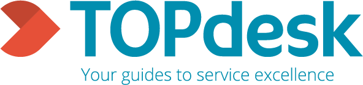

<!--  -->

<!-- **Did you attend Alice & Eve 2024? Please fill out our feedback form: [https://forms.gle/cFKzTXHZQpLtyMY17](https://forms.gle/cFKzTXHZQpLtyMY17)**-->

Welcome to our free one-day workshop for celebrating women studying and working in computing!
Alice & Eve aims to bring together talents in the field of computing. The fourth edition of this workshop will be hosted on **25 October 2024** by the University of Amsterdam.

Alice and Eve event is inspired by the [BCS Lovelace Colloquium](https://bcswomenlovelace.bcs.org/) that started in 2008. For more details about earlier editions of Alice & Eve, see the websites of [2020](https://fmt.ewi.utwente.nl/events/aliceandeve2020/), [2021](https://aliceandeve.cs.ru.nl/), [2022](https://alice-and-eve.github.io/2022/) and [2023](https://alice-and-eve.github.io/2023/).

The event is held during a single day, and features:

- keynote talks,
- a poster contest, and
- an exhibition on women in computing.

Join us, and participate to our poster contest on the topic of your choice!

### Date:

Alice & Eve will take place on October 25th, 2024.

### Venue:

The workshop will be held at Leiden University at Leiden.
<!-- <iframe src="https://www.google.com/maps/embed?pb=!1m18!1m12!1m3!1d2436.8666068656294!2d4.95200197667113!3d52.35470457201834!2m3!1f0!2f0!3f0!3m2!1i1024!2i768!4f13.1!3m3!1m2!1s0x47c6093794c982b7%3A0x5ba7c8690917b951!2sLab42!5e0!3m2!1snl!2snl!4v1697828221735!5m2!1snl!2snl" width="600" height="450" style="border:0;" allowfullscreen="" loading="lazy" referrerpolicy="no-referrer-when-downgrade"></iframe> -->
<iframe src="https://www.google.com/maps/embed?pb=!1m18!1m12!1m3!1d2447.751991104805!2d4.482933476457672!3d52.15701986304036!2m3!1f0!2f0!3f0!3m2!1i1024!2i768!4f13.1!3m3!1m2!1s0x47c5c6f2447daae3%3A0x48e9dc4f075bb167!2z6I6x6aG_5aSn5a2m!5e0!3m2!1szh-CN!2snl!4v1710771504599!5m2!1snl!2snl" width="600" height="450" style="border:0;" allowfullscreen="" loading="lazy" referrerpolicy="no-referrer-when-downgrade"></iframe>

### Registration:

The registration is free and includes coffee breaks, lunch and drinks. We welcome everyone of **all genders**, **from bachelor students to full professors**, to attend the event.

Details regarding the registration will follow soon.

<!-- [SIGN UP HERE](https://docs.google.com/forms/d/e/1FAIpQLSeE9nok8a7G8ulDBM83JNBS9gpw6gkSOA836kO2iAQ4QZaLOw/viewform?usp=pp_url&entry.1084557700=Morning+Coffee&entry.1084557700=Lunch&entry.1084557700=Afternoon+Coffee&entry.1084557700=Drinks) -->

## Program

Details regarding the timeline will update soon.

<!--
| Time |  |
|---|---|
| 09.30 - 09.50  | Registration & welcome coffee (L3.36)|
| 09.50 - 10.00  | Opening (L1.02, for all talks)|
| 10.00 - 10.30  | Talk: **Ana Oprescu** - Trilemmas in Software Systems and Education |
| 10.30 - 11.00  | Talk: **Marcela Tuler de Oliveira** - Distributed Access Control: Bridging Trustworthiness and Transparency in Cross-Organizational Data Sharing |
| 11.00 - 11.30  | Coffee Break (L3.36) |
| 11.30 - 12.00  | Talk: **Carla Groenland** - Why combinatorics is useful for (theoretical) computer science  |
| 12.00 - 12.30  | Talk: **Lynda Hardman** - Exploring Relations in Neuroscience Literature using Augmented Reality |
| 12.30 - 14.00  | Lunch + Poster session + Exhibition  (L3.36) |
| 14.00 - 14.30  | Sponsor Lightning Talks (L1.02, for all talks)|
| 14.30 - 15.00  | Talk: **Marieke van Erp** - Mixing AI and humanities for smell history and heritage: the story of Odeuropa  |
| 15.00 - 15.30  | Talk: **Rianne van den Berg** - AI for the natural sciences|
| 15.30 - 16.00  | Coffee Break (L3.36) |
| 16.00 - 16.50  | Panel: **Closing the Gap: Addressing the Digital Divide through Accessible Technology** (speakers: Emma Beauxis-Aussalet, Hinda Haned, Iffat Rose Gill; moderator: Paola Grosso)
| 16.50 - 17.00  | Poster Prizes + closing |
| 17.00 - 18.00  | Drinks and socials (L3.36) |
-->

## Poster Contest

Details regarding the poster contest will update soon.
<!--We invited all female students (Bachelor/Master/PhD) and early career researchers of computing and related subjects (in the broadest sense) to submit a poster. The poster could be on any computing topic they like: from social networking to quantum computing and from medical image processing to formal verification. Twenty-five posters were short listed for display during the event, where the following winners were chosen:

**Winner: Shruti Rao**

Towards Emotionally Intelligent Spaces: Enhancing Human Well-being and Experiences in Smart Buildings

**Runner-up: Isabella Venancia Gardner**

Machine Learning for Electrostatic Ground-State Simulation of Silicon Dangling Bond Logic: Exploring the Impact of Custom Physical Feature Encodings in Transformer-based Models

Congratulations Shruti and Isabella! We would like to thank Versen for sponsoring the contest and our programme committee (Marco Brohet, Christopher Esterhuyse, Stefan Schlobach, Lise Stork, Krisztina Szilagyi, Monika Trimoska, Romy Vos and Shuai Wang) for their hard work behind the scenes.-->

## Exhibition

Details regarding the exhibition will update soon.
<!-- In addition to the keynote talks and the posters, there will be an exhibition which portrays thirty women in computing
and their most important contributions.

Some highlights of the exhibition:

- **Grace Hopper** who created the world’s first workable compiler;
- **Ada Lovelace** who is known for her work on the design of the ‘Analytics Machine’, the first ever general-purpose
  computer, and the first published algorithm;
- **Rosalind Picard** and her work on Affective Computing which is a combination of Computer Science, Psychology,
  Physiology and Cognitive Sciences;
- **Frances Brazier** who helped establish the first Internet Service Provider (ISP) in the Netherlands and Europe.

More information on these women, and many others, can be found at the exhibition and
the [online booklet](https://fmt.ewi.utwente.nl/events/aliceandeve2020/booklet-13-01-2020.pdf).-->

## Speakers

Details regarding the timeline will update soon.
<!-- We have invited some inspiring women working on the cutting edge of computing. Confirmed speakers include:

- **Rianne van den Berg** - I am a Principal Researcher at Microsoft Research Amsterdam, where I work on the intersection of deep learning and computational chemistry and physics for molecular simulation. My research has spanned a range of topics from generative modeling, variational inference, source compression, graph-structured learning to condensed matter physics. Before joining MSR I was a Research Scientist at Google Brain. I received my PhD in theoretical condensed-matter physics in 2016 at the University of Amsterdam, where I also worked as a postdoctoral researcher as part of the Amsterdam Machine Learning Lab (AMLAB). In 2019 I won the Faculty of Science Lecturer of the Year award at the University of Amsterdam for teaching a machine learning course in the master of AI ([website](https://www.microsoft.com/en-us/research/people/rvandenberg/)).
- **Marieke van Erp** - Marieke van Erp is a Language Technology and Semantic Web expert engaged in interdisciplinary research. She holds a PhD in computational linguistics from Tilburg University and has worked on many (inter)national interdisciplinary projects such as the FP7 NewsReader project, CLARIAH, and the H2020 Odeuropa project. Since 2017, she has been leading the Digital Humanities Research Lab at the Royal Netherlands Academy of Arts and Sciences Humanities Cluster. She is one of the founders and scientific directors of the Cultural AI Lab, a collaboration between 8 research and cultural heritage institutions in the Netherlands aimed at the study, design and development of socio-technological AI systems that are aware of the subtle and subjective complexity of human culture. In January 2024, she was awarded an ERC Consolidator project that will investigate how language and semantic web technologies can improve the creation of knowledge graphs supporting humanities research.
- **Carla Groenland** - After doing bachelor's and master's degrees in both mathematics and artificial intelligence, Carla obtained a mathematics PhD at the University of Oxford and then did a postdoc at the Algorithms group of Utrecht University. She is now an assistant professor at TU Delft, performing research both on abstract properties of networks (and other discrete structures) as well as on how these can be exploited to yield efficient algorithms ([website](https://cgroenland.wordpress.com/)). 
- **Ana Oprescu** - Ana Oprescu is an Assistant Professor in the Complex CyberInfrastructure research group in the Institute of Informatics (IvI) at the University of Amsterdam since 2021. Previously she was a lecturer in the Parallel Computing Systems research group in the same institute. She is the Program Director of the Software Engineering Master, as well as a member of the Women in the Faculty of Science (WiF) board. Together with Paola Grosso and Judith Good, she piloted the Nanny Fund initiative. She received her Senior Teaching Qualification in 2020. Her research goal is to understand the fundamental laws governing the complexity of modern software services such that we can eventually build controllable complex software services. She is currently exploring this interplay in the context of a Responsible Digital Transformation Seed grant on the energy cost of privacy-enhancing techniques and a Stimulation grant on the opportunities to simultaneously optimize energy cost, explainability, and accuracy of ML. Obviously, she secretly thinks everything is a Pareto front.
- **Marcela Tuler de Oliveira** - Assistant Professor in Trustworthy Data Systems at Delft University of Technology, Department of Engineering Systems & Services, Dr. ir. Marcela Tuler de Oliveira stands out as a Telecommunications Engineer shaping the future of cross-organizational data sharing. Her expertise lies in leveraging Distributed Ledger Technology (DLT) for secure, traceable, and accountable data platforms, with impactful solutions spanning sectors like healthcare, aviation, and smart cities. As the task leader for the H2022 EU ExtremeXP project (2024-26), she's driving innovations in data management and access control using DLT. Besides her research, she’s a passionate educator at TU Delft, teaching and mentoring the next wave of tech innovators [website](https://www.tudelft.nl/staff/m.tulerdeoliveira/?cHash=ccdf4dc5f4015e6210a4fd157778321b) [LinkedIn](https://www.linkedin.com/in/marcelatuler/).-->

## Jobs Board

Details regarding the timeline will update soon.
<!-- During the conference, there will be the possibility for attendees to advertise open positions in their university/company. Furthermore, participants looking for jobs are also welcome to post their credentials and type of job/internship they are looking for. Job postings are under the following rules:
- Maximum one A4 flyer per company
- Maximum one A4 sheet per participant looking for jobs
- Each flyer must contain contact information
- Jobs must be pertinent to computing-->

## Organizing Committee

<!-- - [Romana Pernish](https://romana.pernisch.ch), Vrije Universiteit Amsterdam (VU)
- Dolly Sapra, Universiteit van Amsterdam (UvA)
- [Iris Groen](http://www.irisgroen.com), Universiteit van Amsterdam (UvA)
- Rebecca Reiffenhäuser, Universiteit van Amsterdam (UvA)
- Ilaria Battiston, Centrum Wiskunde & Informatica (CWI)
- Michelle Sweering, Centrum Wiskunde & Informatica (CWI)-->
- [Lu Cao](https://www.universiteitleiden.nl/en/staffmembers/lu-cao%5B2%5D#tab-1), Leiden University
- [Olga Gadyatskaya](https://www.universiteitleiden.nl/en/staffmembers/olga-gadyatskaya#tab-1), Leiden University
- [Eleftheria Makri](https://www.universiteitleiden.nl/en/staffmembers/eleftheria-makri#tab-1), Leiden University
- [Shuang Sun](https://www.universiteitleiden.nl/en/staffmembers/shuang-sun#tab-1), Leiden University

## Advisory Committee

Details regarding the advisory committee will update soon.
<!-- - [Peter Bloem](https://peterbloem.nl/), Vrije Universiteit Amsterdam (VU)
- [Judith Good](https://www.uva.nl/en/profile/g/o/j.a.good/j.a.good.html), Universiteit van Amsterdam (UvA)
- [Paola Grosso](https://staff.fnwi.uva.nl/p.grosso/index.html), Universiteit van Amsterdam (UvA)
- [Lynda Hardman](https://homepages.cwi.nl/~lynda/), Centrum Wiskunde & Informatica (CWI)
- [Animesh Kumar Trivedi](https://animeshtrivedi.github.io/), Vrije Universiteit Amsterdam (VU) -->

## Steering committee

Details regarding the steering committee will update soon.
<!-- - [Marieke Huisman](https://people.utwente.nl/m.huisman), Universiteit Twente (UT)
- [Sophie Lathouwers](https://wwwhome.ewi.utwente.nl/~lathouwerssam/), Universiteit Twente (UT)
- [Cynthia Liem](https://www.cynthialiem.com/), Technische Universiteit Delft (TUD)
- [Alma Schaafstal](https://people.utwente.nl/a.m.schaafstal), Universiteit Twente (UT)
- [Alexander Serebrenik](https://www.win.tue.nl/~aserebre/), Technische Universiteit Eindhoven (TU/e)
- [Mariëlle Stoelinga](https://wwwhome.ewi.utwente.nl/~marielle/), Universiteit Twente (UT)-->

## Code of Conduct
Alice and Eve is dedicated to providing a harassment-free conference experience for everyone, regardless of gender, gender identity and expression, sexual orientation, disability, physical appearance, body size, race, age or religion. We do not tolerate harassment of conference participants in any form. Conference participants violating these rules may be sanctioned or expelled from the conference at the discretion of the conference organizers.
Harassment includes, but is not limited to:
- Verbal comments that reinforce social structures of domination related to gender, gender identity and expression, sexual orientation, disability, physical appearance, body size, race, age, religion.
- Sexual images in public spaces
- Deliberate intimidation, stalking, or following
- Harassing photography or recording
- Sustained disruption of talks or other events
- Inappropriate physical contact
- Unwelcome sexual attention
- Advocating for, or encouraging, any of the above behaviour
  
Participants asked to stop any harassing behavior are expected to comply immediately. If someone makes you or anyone else feel unsafe or unwelcome, please report it as soon as possible by contacting Ilaria Battiston (either in person or via [email](mailto:Ilaria Battiston <ilaria@cwi.nl>)) or Iris Groen (either in person or via [email](mailto:Iris Groen <i.i.a.groen@uva.nl>)).
This Code of Conduct was adapted from the [Geek Feminism Wiki anti-harassment policy](https://geekfeminism.fandom.com/wiki/Conference_anti-harassment/Policy).

## Our Sponsors

We are currently looking for sponsors. Contact [Eleftheria Makri](mailto:Eleftheria Makri <e.makri@liacs.leidenuniv.nl>?subject=[Alice and Eve 2024] Sponsoring) for more information and a discussion on how your organization could support the 5th Alice and Eve workshop.

<!--

  

    

      
    

    

      
    

    

      
    

    

      
    

 

  

    

      
    

    

      
    

    

      
    

  

-->
## Hosted by

  

    

      
    

    

      
    

    

      
    

  

## Contact Us

For questions regarding the workshop, please [contact the organizers](mailto:Lu Cao <l.cao@liacs.leidenuniv.nl>, Olga Gadyatskaya <o.gadyatskaya@liacs.leidenuniv.nl>, Eleftheria Makri <e.makri@liacs.leidenuniv.nl>, Shuang Sun <s.sun@liacs.leidenuniv.nl>?subject=[Alice and Eve 2024] Question)!
